# Social-Media-App

Social Media Application created with Nestjs, MongoDB and Angular

# Application Guide

**1.** Go to My [Social Media App](https://social-media-a561c.web.app)
 

**2.** Enter Register Information and click Register
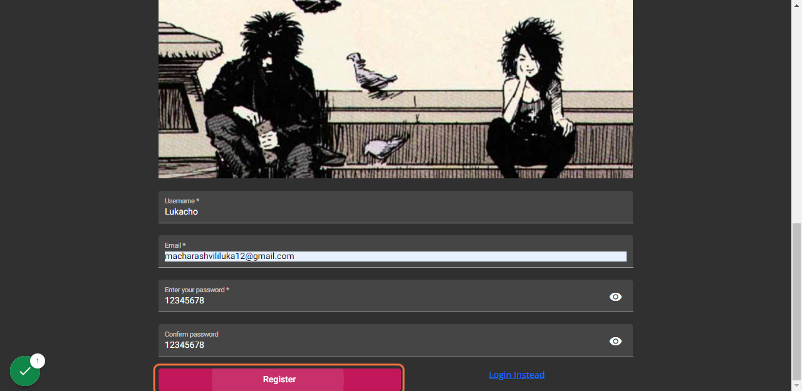
 
**3.** Email Verification Link will be sent on your email, click on it to verify
 
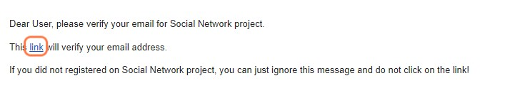
 
**4.** Enter login information and click Log In
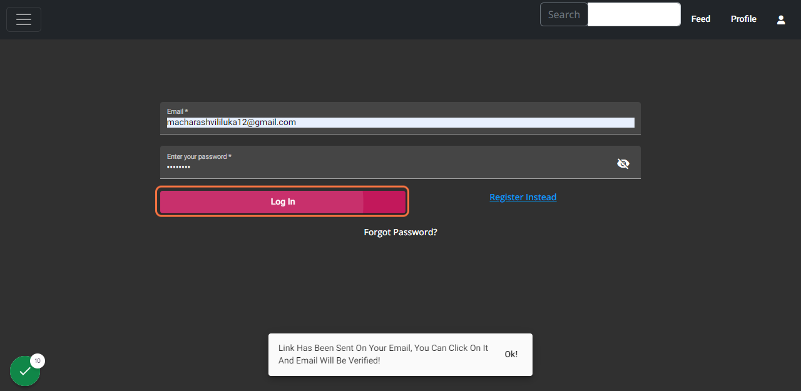
 
**5.** There is nothing on your news feed page, follow people to get some. I'll search for the account I created earlier for testing.
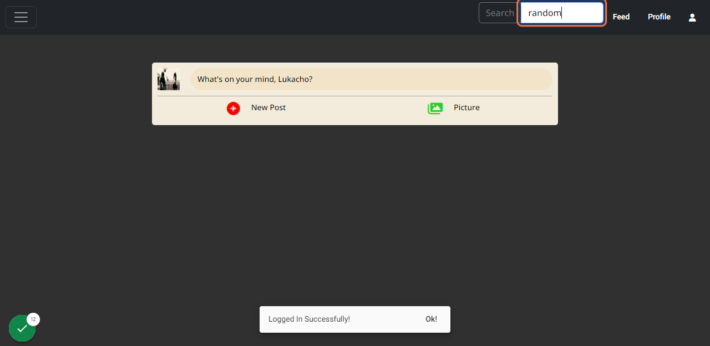
 
**6.** On the search posts section, you can see posts that has word "random" in them!
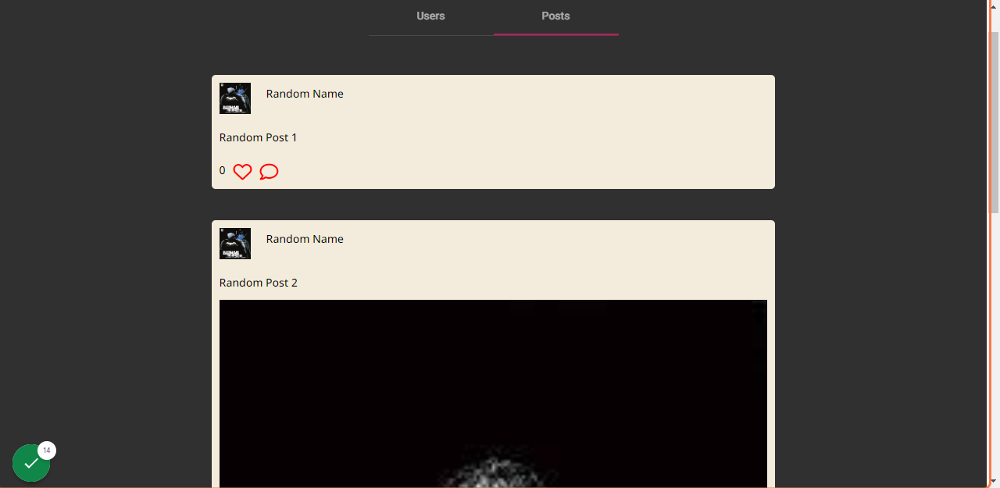
 
**7.** Click on Users to find user that has word "random" in his/her name.
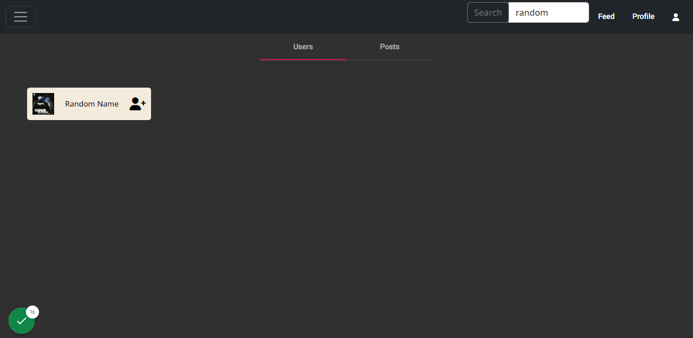
 
**8.** You can follow user's by clicking "user-plus" icon on right, but you can also visit user's profile by clicking on their username or profile picture.
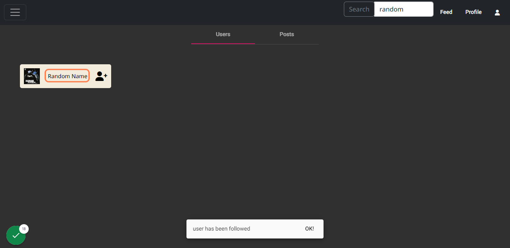
 
**9.** If we click on followers section we will see our profile on that page, because we followed user.
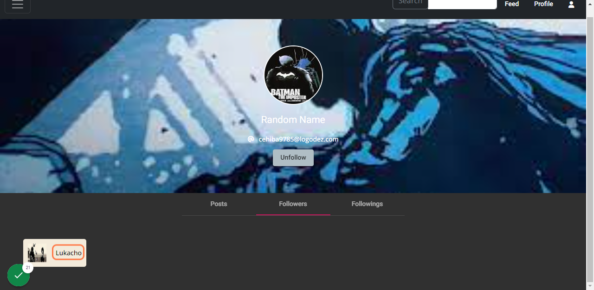
 
**10.** You can go to your profile or news feed page to add posts!
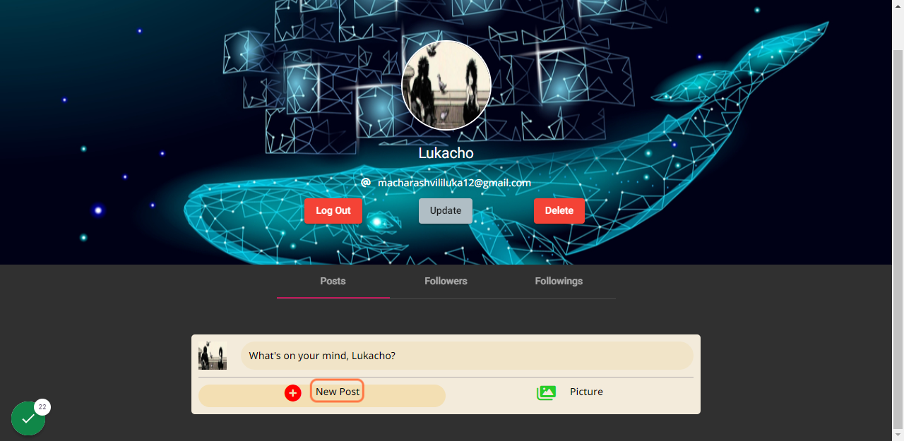
 
**11.** I'll add 3 posts for this guide!
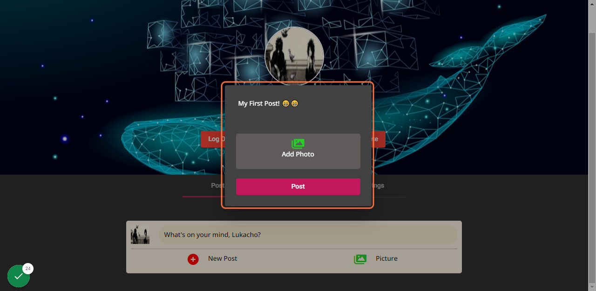
 
**12.** On the feed's page we will be able to see our posts and posts of users we follow!
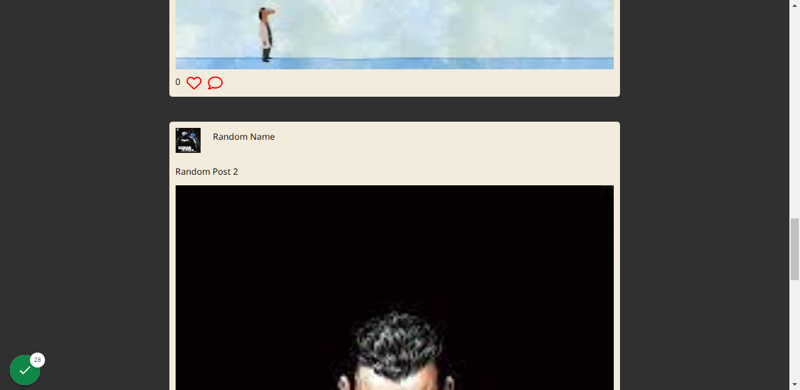
 
**13.** You can like posts by clicking love icon!
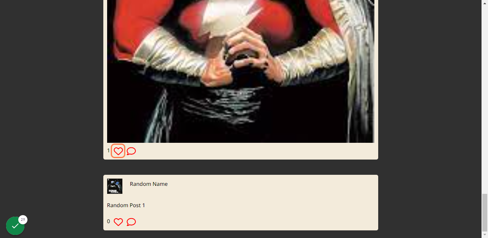
 
**14.** You can see people's list who like that post by clicking on the number of likes on the left!
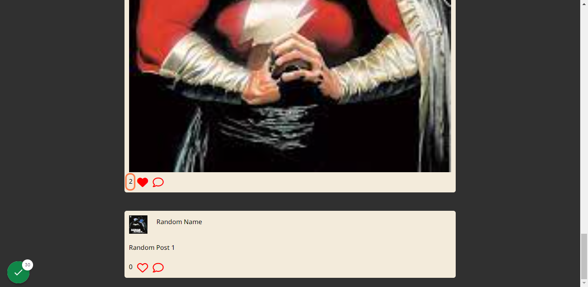
 
**15.** You can add comments by clicking the comment icon and then "comment" button.
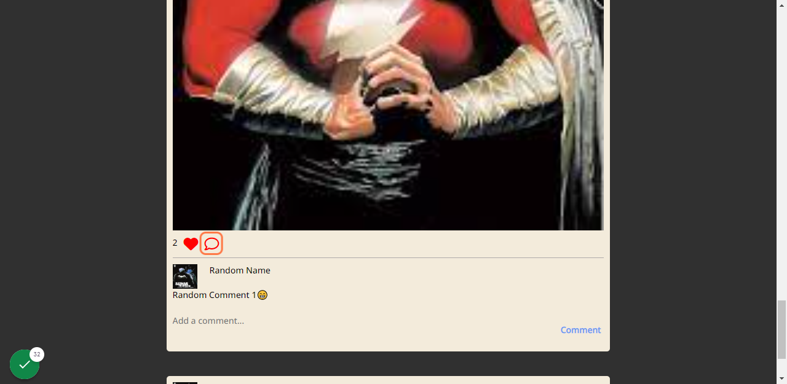
 
**16.** You are able to delete comments by clicking "three-dots" icon and clicking delete button.
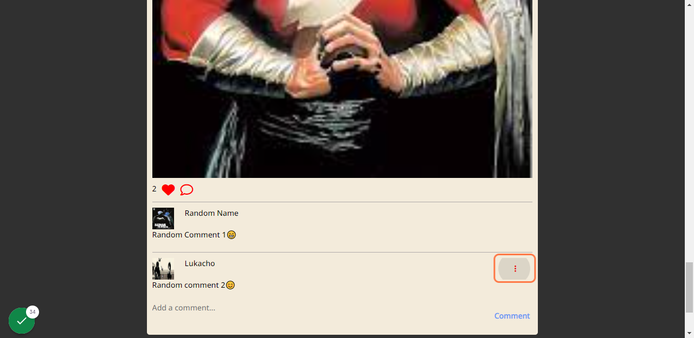
 
**17.** And you are also able to delete or update you posts by clicking on the "three-dots" icon.
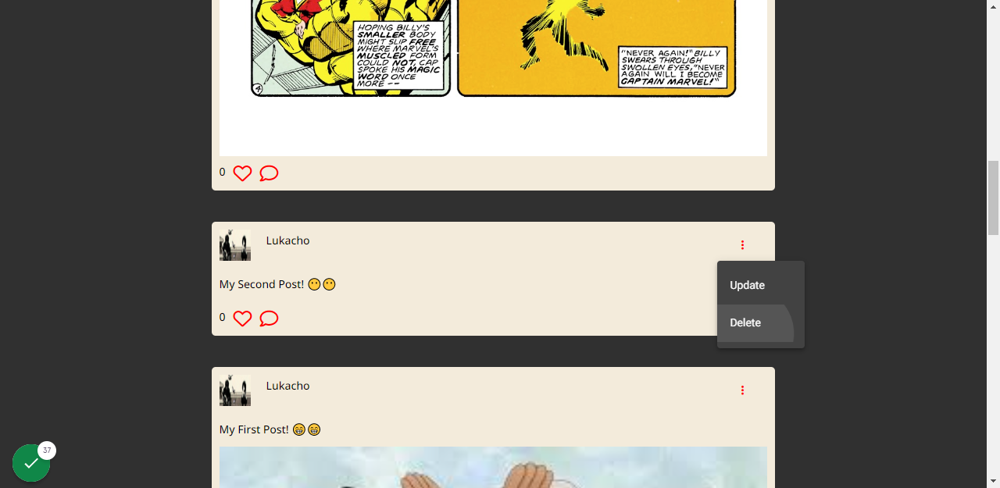
 
